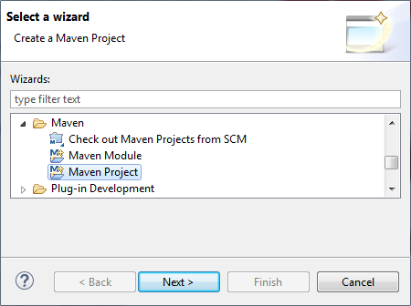
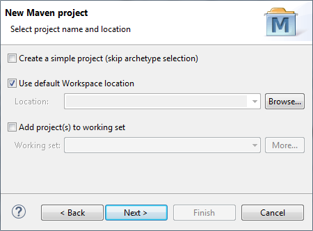
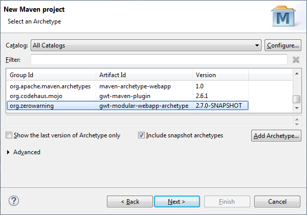
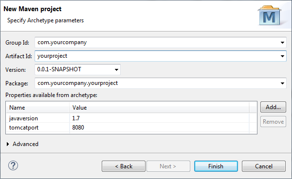
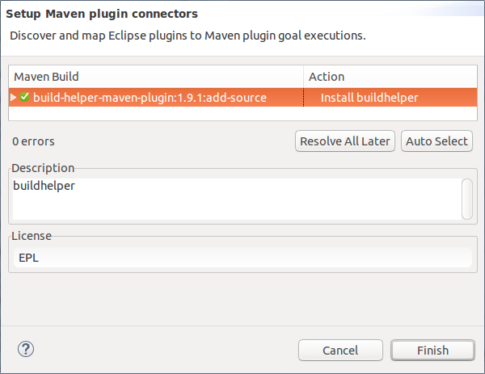
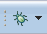
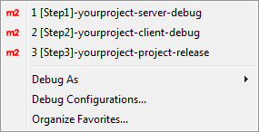

# gwt-modular-webapp-archetype
> A maven archetype that generates multi-module GWT projects with full [Eclipse IDE](https://eclipse.org) support.

## Introduction

**gwt-modular-webapp-archetype** is a [Maven](https://maven.apache.org/) [archetype](https://maven.apache.org/guides/introduction/introduction-to-archetypes.html) that helps you build [modular](https://maven.apache.org/guides/mini/guide-multiple-modules.html) [GWT](http://www.gwtproject.org) web applications. It provides the following features :
* Perfect isolation between server and client modules.
* Out of the box Eclipse IDE launch configurations.
* GWT Codeserver debug profile for better productivity in development.
* GWT Compiler production profile for the best performance on deployment.
* Rewritten GWT Starter code.
* Automatic [Asynchronous Interfaces](http://www.gwtproject.org/doc/latest/tutorial/RPC.html) Generation.

## Requirements
* [JDK 1.7](http://www.oracle.com/technetwork/es/java/javase/downloads/jdk7-downloads-1880260.html) or [JDK 1.6](http://www.oracle.com/technetwork/java/javase/downloads/java-archive-downloads-javase6-419409.html)

> GWT 2.7.0 can only compile JAVA source code of level 1.6 or 1.7. For simplicity the same source level is used for the whole project.

* [Maven 3](https://maven.apache.org/download.cgi)

>Maven requires a JDK installation (a JRE is not sufficient).

## Installing the archetype
First, you need to install **gwt-modular-webapp-archetype** in your Maven repository, whether you are planning to run it using the CLI or Eclipse.

In a terminal, under the directory of your choosing, issue the following commands :
```
$ git clone https://github.com/ilyes4j/gwt-modular-webapp-archetype.git
$ cd gwt-modular-webapp-archetype
$ mvn install
```

## Getting started using the CLI
If you just want to run your application immediately without the need for advanced IDE  capabilities, it is possible to use the CLI.

### 1. Generate the project
Open a terminal and issue the following command :

* On a Unix based system

```shell
$ mvn archetype:generate \
  -B \
  -DarchetypeCatalog=local \
  -DarchetypeGroupId=org.zerowarning \
  -DarchetypeArtifactId=gwt-modular-webapp-archetype \
  -DarchetypeVersion=2.7.0-SNAPSHOT \
  -DgroupId=com.yourcompany \
  -DartifactId=yourproject \
  -Dversion=1.0.0-SNAPSHOT \
  -Dpackage=com.yourcompany.yourproject \
  -Djavaversion=1.7 \
  -Dtomcatport=8080
```

* On a Windows based system :

```shell
$ mvn archetype:generate ^
  -B ^
  -DarchetypeCatalog=local ^
  -DarchetypeGroupId=org.zerowarning ^
  -DarchetypeArtifactId=gwt-modular-webapp-archetype ^
  -DarchetypeVersion=2.7.0-SNAPSHOT ^
  -DgroupId=com.yourcompany ^
  -DartifactId=yourproject ^
  -Dversion=1.0.0-SNAPSHOT ^
  -Dpackage=com.yourcompany.yourproject ^
  -Djavaversion=1.7 ^
  -Dtomcatport=8080
```

Congratulations ! Your project is ready for use under **yourproject** directory. The resulting project is structured as follows :

<table>
	<tr>
		<th>Folder</th>
		<th>Description</th>
	</tr>
	<tr>
		<td><b>yourproject</b></td>
		<td>The <b>Parent module</b> under which all related Maven
			modules are aggregated.
		</td>
	</tr>
	<tr>
		<td><b>yourproject</b>-<i>client</i></td>
		<td>The <b>Client module</b> contains JAVA code to be compiled
			into HTML/CSS/JS by the GWT compiler.
		</td>
	</tr>
	<tr>
		<td><b>yourproject</b>-<i>launch</i></td>
		<td>The <b>Launch folder</b> contains Eclipse <b>.launch</b>
			files to make working on your project inside Eclipse as easy as
			possible.
		</td>
	</tr>
	<tr>
		<td><b>yourproject</b>-<i>server</i></td>
		<td>The <b>Server module</b> contains the server side code and
			resources that are not compiled by the GWT compiler.
		</td>
	</tr>
	<tr>
		<td><b>yourproject</b>-<i>shared</i></td>
		<td>The <b>Shared module</b> contains model classes exchanged
			between the client and the server.
		</td>
	</tr>
</table>


### 2. Run the project in development mode
In development mode, two servers are involved to run your application. [**Tomcat**](http://tomcat.apache.org/) server runs the server module and [**Codeserver**](http://www.gwtproject.org/articles/superdevmode.html) using [**Jetty**](http://www.eclipse.org/jetty/) runs the client module. You don't have to worry about setting them up, they are shipped with the project build.
##### a. Run the server module
In the first terminal go to **yourproject** directory and issue the following command
```
$ mvn package -pl yourproject-server -am -Pdebugserver
```
##### b. Run the client module
In a second terminal go to **yourproject** directory and issue the following command
```
$ mvn package -pl yourproject-client -am -Pdebugclient
```
##### c. Preview the application
Preview the application by opening your browser at [**http://localhost:8080**](http://localhost:8080).

> In development mode, by default, the application runs only on WebKit based browsers. In order to speed up GWT code generation, **App-dev.gwt.xml** module produces a single permutation for WebKit. This means that in development mode, the application can only run on [Chrome](https://www.google.com/intl/en/chrome/browser/desktop/) or [Safari](http://www.apple.com/safari/). It is possible to target other browsers by setting **user.agent**. The list of all possible user agents si available [Here](https://gwt.googlesource.com/gwt/+/master/user/src/com/google/gwt/useragent/UserAgent.gwt.xml).

>To support debugging for Firefox and Chrome set **user.agent** property in **App-dev.gwt.xml** to :
```xml
<set-property name="user.agent" value="gecko1_8,safari" />
```

### 3. Package the application
To package your project for deployment, in a terminal go to **yourproject** directory and issue the following command :
```
$ mvn clean verify
```

Your application is now packaged, ready for deployment and available here :
```
[project-name]/[project-name]-server/target/[project-name]-server-[version].war
```


## Using the archetype with Eclipse IDE
**gwt-modular-webapp-archetype** works perfectly with Eclipse and provides a set of launch configurations to help you manage your project.

### 1. Setup Eclipse
* Install [**Eclipse IDE for Java EE Developers**](http://www.eclipse.org/downloads/packages/eclipse-ide-java-ee-developers/mars1)
* [**Register**](http://techiedan.com/2009/10/19/set-up-jdk-in-eclipse/) JDK in Eclipse

### 2. Generate the project
* Inside Eclipse, navigate to **File > New > Other…** in order to bring up the project creation wizard.
* Scroll to the **Maven** folder, choose **Maven Project**, then hit **Next**.


* Leave the default options for the next panel and hit **Next**.


* Check the option **Include snapshot archetypes** and select the artifact that has _Group Id_=**org.zerowarning**, _Artifact Id_=**gwt-modular-webapp-archetype** and _Version_=**2.7.0-SNAPSHOT**. Then hit **Next**.



* Finally, specify the parameters for the artifact to be generated  and optionally override the default extra parameters and hit **Finish**.



Extra Parameter|Default|Description
:-|:-:|:-
javaversion| 1.7 | Can be **1.6** or **1.7**, any other value can lead to an unexpected behavior. The chosen value must match the JDK setup for your Eclipse workspace to avoid unpleasant warnings about JDK mismatch.
tomcatport| 8080 | When running multiple tomcat instances at the same time, please set **tomcatport** to an available port.

Congratulations, you have successfully generated your project using Eclipse !

* The generated project uses [**build-helper-maven-plugin**](http://www.mojohaus.org/build-helper-maven-plugin/) to add Asynchronous Interfaces on the fly to the source path. In order for [**M2Eclipse**](http://www.eclipse.org/m2e/) to know how to handle that plugin it must acquire the **m2e connector for build-helper-maven-plugin**. If the connector is not yet installed, Eclipse will automatically ask you to do so as soon as the project is created. Hit **Next** to install the connector.



### 3. Run the project in development mode
Working on the newly generated project is made easy as lunch configurations are shipped with the generated project. In the menu bar click the **debug** button to open the debug menu.





* a. Run the server module by selecting **_[Step1]-yourproject-server-debug_**.
* b. Run the client module
by selecting **_[Step2]-yourproject-client-debug_**.
* c. Launch the application by
opening your browser at [**http://localhost:8080**](http://localhost:8080).

### 4. Package the application
To package your project for deployment select  **_[Step3]-yourproject-project-release_**.
## License

Mohamed ilyes Dimassi, 2015. Licensed under the [MIT](https://github.com/ilyes4j/gwt-modular-webapp-archetype/blob/master/LICENSE) license.
